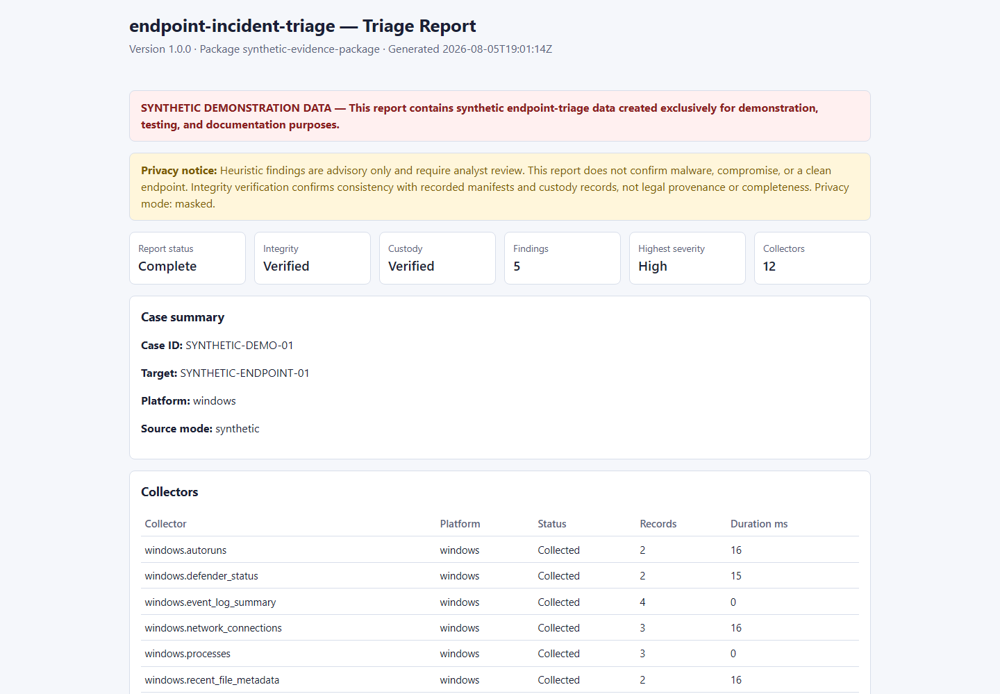

# endpoint-incident-triage

[](https://github.com/salvomazzaglia/endpoint-incident-triage/actions/workflows/ci.yml)


**Cross-platform, non-destructive endpoint incident-triage toolkit with evidence-integrity verification, tamper-evident custody logging, and privacy-aware reporting.**

> The screenshot, example evidence package, and reports contain **synthetic demonstration data only**. No real endpoint, user, process, network, repository, credential, or incident information is included.

> **Authorization required.** Use this toolkit only on systems you own or are explicitly authorized to examine. Unauthorized collection is prohibited.

> **Live collection changes system state.** This toolkit is designed to be non-destructive and minimally invasive, but it is **not** a substitute for forensic imaging, memory acquisition, or formal evidence-handling procedures.



---

## Value proposition

**endpoint-incident-triage** helps authorized responders collect, normalize, hash, verify, package, and report selected security-relevant artifacts from Windows and Linux endpoints. It answers operational triage questions — who was logged on, what was running, what persisted, what connected outward — while recording integrity metadata (SHA-256 manifest, hash-chained custody ledger) and producing analyst-ready JSON/HTML reports with configurable privacy transforms.

Unlike forensic imaging suites, this project focuses on **live-response collection** with explicit limitations, synthetic CI-safe demonstrations, and defensive heuristic findings that require human review.

---

## Problem being solved

During active incidents, responders need structured answers quickly:

- What system was examined and when?
- Which collectors ran and with what outcomes?
- What users, processes, connections, and persistence mechanisms were observed?
- Can the evidence package be verified against its manifest?
- Has anything changed since collection?

Manual copy/paste from native tools produces inconsistent artifacts, weak provenance, and accidental secret leakage. This toolkit standardizes collection, adds integrity verification, and separates **raw evidence sensitivity** from **shareable reports**.

---

## Non-destructive design

Live collection is **minimally invasive**, not perfectly read-only. Running collectors can affect process state, caches, file-access metadata, event logs, and timing. The toolkit:

- Does **not** create forensic disk images or acquire volatile memory
- Does **not** extract credentials, LSASS dumps, or registry hives
- Does **not** modify services, tasks, firewall rules, or logs
- Does **not** self-elevate or disable security controls
- Uses an **allowlisted collector registry** — arbitrary scripts cannot execute

See [docs/authorization-and-scope.md](docs/authorization-and-scope.md) and [docs/methodology.md](docs/methodology.md).

---

## Main features

| Area | Capability |
|------|------------|
| **Planning** | `plan` — preview collectors without execution |
| **Collection** | `collect` (acknowledged live) and `collect-synthetic` (fixtures only) |
| **Integrity** | SHA-256 manifest, `SHA256SUMS`, tamper-evident custody ledger |
| **Verification** | Directory or ZIP package verification |
| **Analysis** | UTC timeline, defensive heuristic findings |
| **Reporting** | Standalone JSON/HTML with masked, hashed, or full privacy modes |
| **Packaging** | Optional ZIP with checksum sidecar |
| **Platforms** | Windows PowerShell collectors + Linux Bash collectors |
| **Testing** | pytest, Pester, Bats, ShellCheck, shfmt, Ruff, mypy |

---

## Supported platforms

| Role | Versions |
|------|----------|
| **Live collection targets** | Windows 10/11, Windows Server 2019+, Ubuntu 22.04/24.04 LTS, Debian 12 (best-effort) |
| **Development / CI** | Python 3.11–3.12, PowerShell 5.1+, Bash 5+ |
| **Orchestrator** | Cross-platform Python CLI |

---

## Collection profiles

| Profile | Scope |
|---------|--------|
| **minimal** | Context, time, users/sessions, processes, network, services/systemd, scheduled tasks/timers, basic persistence, bounded events, Defender status (Windows) |
| **standard** | Adds WMI/cron persistence, SSH authorized_keys metadata (no key content), extended events, optional recent-file metadata in allowlisted roots |

See [docs/collection-profiles.md](docs/collection-profiles.md).

---

## Collection order

Collectors run by ascending **volatility order**: clock and sessions before processes and network, persistence and logs afterward, bounded file metadata last. This is a pragmatic live-response sequence, not a guarantee that all volatile evidence is preserved.

See [docs/collection-order.md](docs/collection-order.md).

---

## Windows collectors

Twelve PowerShell collectors under `collectors/windows/`:

`system-context`, `time-context`, `users-sessions`, `processes`, `network-connections`, `services`, `scheduled-tasks`, `autoruns`, `wmi-persistence`, `defender-status`, `event-log-summary`, `recent-file-metadata`.

See [docs/windows-collectors.md](docs/windows-collectors.md).

---

## Linux collectors

Eleven Bash collectors under `collectors/linux/`:

`system-context`, `time-context`, `users-sessions`, `processes`, `network-connections`, `systemd-services`, `systemd-timers`, `cron-persistence`, `auth-event-summary`, `ssh-key-metadata`, `recent-file-metadata`.

See [docs/linux-collectors.md](docs/linux-collectors.md).

---

## Quick start

```bash
git clone https://github.com/salvomazzaglia/endpoint-incident-triage.git
cd endpoint-incident-triage
python -m pip install -e ".[dev]"

# Validate configuration
endpoint-incident-triage validate-config --config config/demo.config.json

# Preview a Windows minimal plan (no execution)
endpoint-incident-triage plan \
  --config config/demo.config.json \
  --profile minimal \
  --platform windows

# List allowlisted collectors
endpoint-incident-triage list-collectors --config config/demo.config.json
```

---

## Synthetic demo

All repository examples use deterministic synthetic fixtures (`SYNTHETIC-ENDPOINT-01`, documentation IP ranges, locally administered MACs).

```bash
python scripts/generate-demo-data.py

endpoint-incident-triage collect-synthetic \
  --case-id SYNTHETIC-CASE-001 \
  --platform windows \
  --output-directory temp/synthetic-case

endpoint-incident-triage verify --package examples/synthetic-evidence-package

endpoint-incident-triage report \
  --package examples/synthetic-evidence-package \
  --output-directory temp/reports \
  --format all \
  --privacy-mode masked
```

Sample reports: [examples/sample-triage-report.json](examples/sample-triage-report.json), [examples/sample-triage-report.html](examples/sample-triage-report.html).

---

## Live collection workflow

Live collection requires explicit acknowledgement and organizational authorization:

```bash
endpoint-incident-triage collect \
  --acknowledge-live-collection \
  --case-id IR-2026-001 \
  --authorization-reference AUTH-TICKET-123 \
  --operator-label RESPONDER-01 \
  --profile minimal \
  --output-directory /path/to/evidence
```

Optional sensitive flags (disabled by default):

- `--include-command-lines` — may capture credentials in process arguments
- `--include-event-messages` — may include personal or sensitive event text

**Do not run live collection in CI or unverified automation.**

---

## Evidence-package structure

```
case-<CASE-ID>-<STAMP>/
├── README.txt
├── metadata/          case, collection, host-context, tool, manifest-hash
├── artifacts/         platform JSON collector outputs
├── timeline/          timeline.jsonl
├── findings/          findings.json
├── manifests/         manifest.json, SHA256SUMS
├── custody/           custody.jsonl
└── logs/              collector-execution.jsonl
```

See [docs/evidence-package.md](docs/evidence-package.md).

---

## SHA-256 manifest

Every file in scope is hashed with streaming SHA-256. `manifest.json` lists relative paths, sizes, hashes, and artifact types. The manifest hash is recorded separately in `metadata/manifest-hash.json` and the custody ledger to avoid self-inclusion.

See [docs/manifest-and-verification.md](docs/manifest-and-verification.md).

---

## Custody ledger

A JSONL hash chain records collection lifecycle events. Verification detects mutation, deletion, insertion, and reorder. The ledger is **tamper-evident**, not tamper-proof, and does not prove actor identity without external trust anchors.

See [docs/custody-ledger.md](docs/custody-ledger.md) and [docs/chain-of-custody-limitations.md](docs/chain-of-custody-limitations.md).

---

## Package verification

```bash
endpoint-incident-triage verify --package examples/synthetic-evidence-package
endpoint-incident-triage verify --package path/to/case.zip
```

Verification checks manifest consistency, artifact hashes, path safety, symlink rejection, custody chain integrity, and schema versions.

---

## Timeline

Supported timestamps normalize to UTC ISO 8601 while preserving original values, precision notes, and timezone assumptions. See [docs/timeline-model.md](docs/timeline-model.md).

---

## Heuristic findings

A deterministic rule engine flags **context-dependent** items for analyst review (temporary-path execution, writable service paths, SSH key permission issues, etc.). Findings are **not malware verdicts**.

See [docs/heuristic-findings.md](docs/heuristic-findings.md).

---

## Privacy modes

| Mode | Behavior |
|------|----------|
| **masked** (default) | Mask usernames, hostnames, IPs, MACs; generalize paths in reports |
| **hashed** | Stable SHA-256 pseudonyms with salt from environment variable |
| **full** | Raw identifiers — strong warning; never use for public samples |

Raw evidence packages remain sensitive regardless of report mode. See [docs/privacy-and-redaction.md](docs/privacy-and-redaction.md).

---

## Reports

Generate after successful verification:

```bash
endpoint-incident-triage report \
  --package examples/synthetic-evidence-package \
  --output-directory temp/reports \
  --format all \
  --privacy-mode masked
```

HTML reports are fully standalone (no CDN, no remote assets). See [docs/reports.md](docs/reports.md).

---

## Exit codes

| Code | Meaning |
|------|---------|
| `0` | Success |
| `1` | Partial success (optional collectors unavailable, warnings) |
| `2` | Mandatory failure, integrity failure, or `--fail-on-high-finding` |
| `3` | Configuration, path, or internal error |

See [docs/exit-codes.md](docs/exit-codes.md).

---

## Architecture

```mermaid
flowchart LR
  A[Operator authorization\nand case metadata] --> B[Validated collection profile]
  B --> C[Allowlisted collector registry]
  C --> D[Platform collectors]
  D --> E[Structured normalization]
  E --> F[Evidence package]
  F --> G[SHA-256 manifest]
  G --> H[Custody ledger]
  H --> I[UTC timeline]
  I --> J[Heuristic review rules]
  J --> K[Privacy transformation]
  K --> L[JSON and HTML reports]
  L --> M[Package verification]
```



See [docs/architecture.md](docs/architecture.md).

---

## Testing

| Suite | Location | Purpose |
|-------|----------|---------|
| pytest | `tests/python/` | Core Python logic, guards |
| Pester | `tests/pester/` | Windows collector safety and fixtures |
| Bats | `tests/bats/` | Linux collector safety and fixtures |

```bash
python -m pytest tests/python
pwsh -Command "Invoke-Pester -Path tests/pester"
bats tests/bats/
python scripts/run-ci.py
```

See [docs/testing.md](docs/testing.md).

---

## Security

Report vulnerabilities privately per [SECURITY.md](SECURITY.md). Review [docs/threat-model.md](docs/threat-model.md) and [docs/security-audit-v1.0.0.md](docs/security-audit-v1.0.0.md).

---

## Known limitations

- Not a forensic image, memory acquisition tool, or legal-admissibility framework
- Live collection has side effects; volatile evidence may be lost before collection
- Heuristic findings produce false positives; analyst validation required
- ZIP packaging is not encrypted
- Custody ledger lacks external timestamp authority in v1.0
- Clock skew and missing timezone metadata affect timeline confidence

---

## Roadmap

Future versions may add optional remote orchestration hooks, signed manifests, and expanded collector coverage — always behind explicit authorization and design review. Out of scope: memory/disk acquisition, credential extraction, automated containment.

---

## Skills demonstrated

Incident response · Digital forensics fundamentals · Endpoint triage · Windows/Linux administration · Python · PowerShell · Bash · Evidence integrity · SHA-256 · Timeline analysis · Defensive detection engineering · Privacy-aware reporting · pytest · Pester · PSScriptAnalyzer · Bats · ShellCheck · shfmt · Ruff · mypy · GitHub Actions · Cross-platform CI · Technical documentation

---

## Contributing

Contributions welcome! See [CONTRIBUTING.md](CONTRIBUTING.md). Use synthetic fixtures only; never commit live endpoint data.

---

## License

[MIT License](LICENSE) — Copyright © 2026 Salvatore Mazzaglia

---

## Author

**Salvatore Mazzaglia** — [@salvomazzaglia](https://github.com/salvomazzaglia)

Repository: [https://github.com/salvomazzaglia/endpoint-incident-triage](https://github.com/salvomazzaglia/endpoint-incident-triage)
