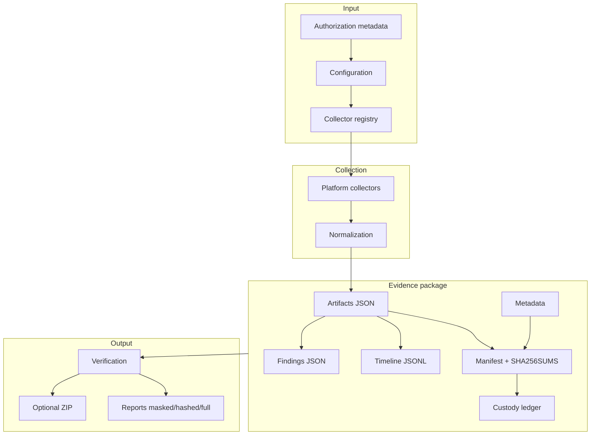

# Architecture

## Overview

endpoint-incident-triage separates **orchestration** (Python), **collection** (platform scripts), and **integrity/reporting** (Python modules). All paths flow through validated configuration and an allowlisted collector registry.

## Components

| Layer | Responsibility |
|-------|----------------|
| CLI | Command routing, authorization gates, exit codes |
| Config / registry | Profiles, collector allowlist, rules, safety settings |
| Collector runner | Timeouts, fixture mode, normalization, provenance |
| Case / paths | Package layout, case IDs, output guards |
| Manifest / hashing | Streaming SHA-256, deterministic ordering |
| Custody | Hash-chained JSONL audit trail |
| Timeline | UTC normalization from collector records |
| Findings | Deterministic heuristic rules |
| Privacy / reports | Redaction, JSON/HTML generation |
| Verification / package | Integrity checks, ZIP creation |

## Data flow

## Design decisions

- **Allowlist over plugin model** — prevents arbitrary script execution from case data or user input.
- **Fixture-first development** — CI and contributors never inspect real hosts.
- **Manifest hash exclusion** — final manifest hash stored outside manifest scope to avoid self-reference loops.
- **Advisory findings** — rules flag review items; no automated compromise verdicts.
- **Privacy at report layer** — raw evidence remains sensitive; reports apply transforms.

## Module map

Python package `endpoint_incident_triage` under `src/`:

- `cli.py` — entry point
- `collector_runner.py` — subprocess execution without `shell=True`
- `manifest.py`, `custody.py`, `verification.py` — integrity
- `findings.py`, `rules.py` — heuristics
- `json_report.py`, `html_report.py` — reporting

Platform scripts live under `collectors/windows/` and `collectors/linux/`.

## Trust boundaries

| Trust | Assumption |
|-------|------------|
| Operator | Authorized to collect; controls output directory |
| Host OS | May be compromised; collectors read attacker-visible state |
| Repository | Maintainers ship non-destructive allowlisted scripts |
| Evidence package | Integrity checks detect post-collection tampering, not pre-collection truth |

See [threat-model.md](threat-model.md).
